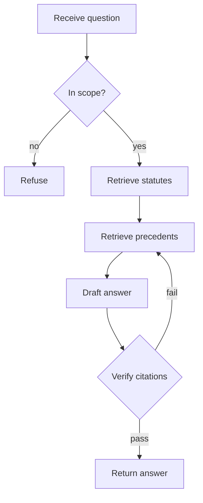

# State and flow

The graph state tracks the user's question, retrieved sources, drafted answer,
citation-verification results, and final outcome. The high-level flow is:

```mermaid
graph TD
    A[Receive question] --> B{In scope?}
    B -->|no| C[Refuse]
    B -->|yes| D[Retrieve statutes]
    D --> E[Retrieve precedents]
    E --> F[Draft answer]
    F --> G{Verify citations}
    G -->|fail| E
    G -->|pass| H[Return answer]
```
